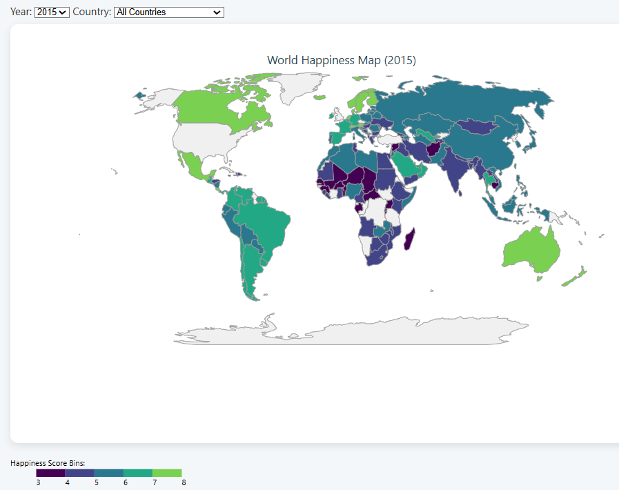
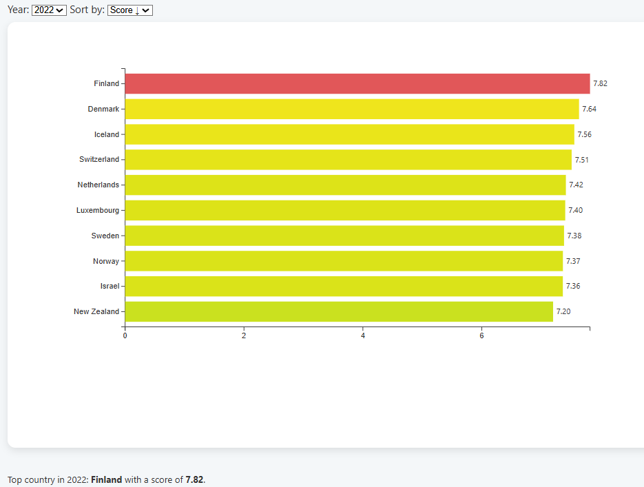
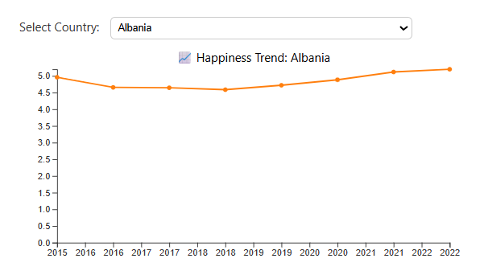

# 🌍 World Happiness Report Dashboard (2015–2022)

[](https://worldhappinessreport2015-2022.netlify.app)
[](https://github.com/sumrunsahabkhan/World-Happiness-Dashboard-2015-2022-)
[](LICENSE)


> An interactive, web-based data visualization platform built with **D3.js** to explore global happiness trends across **150+ countries** from **2015 to 2022**, using data from the United Nations Sustainable Development Solutions Network.

---

## 📸 Dashboard Preview

<!-- Replace these with actual screenshots of your dashboard -->
| Choropleth Map | Bar Chart Rankings | Trend Lines |
|---|---|---|
|  |  |  |

> 🔗 **[View Live Dashboard →](https://worldhappinessreport2015-2022.netlify.app)**

---

## ✨ Features

| Feature | Description |
|---|---|
| 🗺️ **Choropleth Map** | World happiness distribution by year with country-level tooltips |
| 📊 **Ranked Bar Chart** | Top 10 happiest & least happy countries per year, sortable |
| 📈 **Multi-Country Line Chart** | Compare happiness trends of up to 4 countries (2015–2022) |
| 🔵 **Bubble Chart** | All-time happiness rankings with factor breakdowns |
| 🔍 **Scatter Plot** | Correlations between happiness and GDP, social support, life expectancy |

---

## 🛠️ Tech Stack

- **Visualization:** D3.js v7
- **Frontend:** HTML5, CSS3, Vanilla JavaScript (ES6+)
- **Data Processing:** Python (pandas, country_converter)
- **Hosting:** Netlify (CI/CD from GitHub)
- **Version Control:** Git & GitHub

---

## 📂 Project Structure

```
World-Happiness-Dashboard/
├── css/
│   └── style.css              # All dashboard styles
├── data/
│   └── happiness_cleaned.csv  # Merged & cleaned dataset (2015–2022)
├── js/
│   ├── bar.js                 # Bar chart visualization
│   ├── bubble.js              # Bubble chart visualization
│   ├── line.js                # Line chart visualization
│   ├── map.js                 # Choropleth map visualization
│   └── scatter.js             # Scatter plot visualization
├── index.html                 # Main dashboard entry point
└── README.md
```

---

## 📊 Dataset

| Property | Details |
|---|---|
| **Source** | [World Happiness Report (Kaggle)](https://www.kaggle.com/datasets/mathurinache/world-happiness-report) |
| **Years** | 2015 – 2022 |
| **Countries** | 150+ |
| **Features** | Country, Year, Happiness Score, GDP per Capita, Social Support, Life Expectancy, Freedom, Generosity, Perceptions of Corruption |

### Data Preprocessing (Python)
- Standardized inconsistent column names across 8 yearly CSVs using a `rename_map`
- Normalized country names using `country_converter` library
- Replaced European decimal formats (e.g., `7,821` → `7.821`)
- Merged all years into a single unified `happiness_cleaned.csv`

---

## 🚀 Getting Started

### Prerequisites
- A modern browser (Chrome, Firefox, Edge)
- VS Code (recommended) OR Python 3.x

### Option 1: Run with VS Code Live Server *(Recommended)*

```bash
# 1. Clone the repository
git clone https://github.com/sumrunsahabkhan/World-Happiness-Dashboard-2015-2022-.git

# 2. Open in VS Code
cd World-Happiness-Dashboard-2015-2022-
code .

# 3. Install "Live Server" extension (if not already installed)
#    Search: "Live Server" by Ritwick Dey

# 4. Right-click index.html → "Open with Live Server"
#    Opens at: http://127.0.0.1:5500
```

### Option 2: Run with Python

```bash
# 1. Clone the repository
git clone https://github.com/sumrunsahabkhan/World-Happiness-Dashboard-2015-2022-.git
cd World-Happiness-Dashboard-2015-2022-

# 2. Start local server
python -m http.server 8000

# 3. Open browser at:
#    http://localhost:8000
```

> ⚠️ **Note:** Must run via a local server (not by opening index.html directly) because D3.js loads CSV data via fetch requests, which are blocked by browsers when using `file://` protocol.

---

## 📈 Key Insights

- 🏆 **Finland** has ranked #1 happiest country for 5 consecutive years (2018–2022)
- 📉 **Afghanistan** showed the steepest happiness decline across the 8-year period
- 💰 **GDP per capita** shows the strongest positive correlation with happiness scores
- 🤝 **Social support** is nearly as influential as GDP in predicting happiness
- 🌍 **Western Europe** consistently dominates the top happiness rankings

---

## 🤝 Authors

| Name | ID |
|---|---|
| **Sumrun Sahab Khan** | Data Processing, Visualization |

---

## 📄 License

This project is licensed under the [MIT License](LICENSE) — feel free to use and build upon it.

---

## 🌟 Acknowledgements

- [UN Sustainable Development Solutions Network](https://www.unsdsn.org/) for the World Happiness Report data
- [D3.js](https://d3js.org/) by Mike Bostock
- [Natural Earth](https://www.naturalearthdata.com/) for GeoJSON map data

---

<p align="center">
  Made with ❤️ and D3.js &nbsp;|&nbsp; 
  <a href="https://worldhappinessreport2015-2022.netlify.app">Live Demo</a> &nbsp;|&nbsp;
  <a href="#-getting-started">Get Started</a>
</p>
